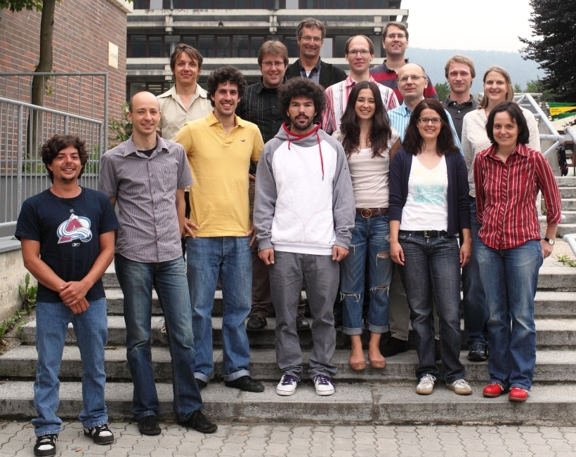



# Introduction

The Unit of Environmental Engineering (IUT) is part of the biggest Education and Research Institution in western Austria, that is the University Innsbruck. It belongs to the Faculty of Civil Engineering. The Unit employs currently a total staff of 20 persons including 6 PhD students. It is organised in 2 sections, one covering urban water management, and the other waste- and resource management.

Central to the department is the investigation of environmental problems both in research and teaching, with special emphasis on regional (alpine) aspects. The aim is to develop technical and sustainable solutions in order to minimise the impact of society on the environment.

# Software 

 * CityDrain3
 * DynaMind
 * Calimero
 * CITYDRAIN II

# Posts

<ul class="posts">
  
    <li>{{ post.date | date_to_string }} &raquo; <a href="{{ BASE_PATH }}{{ post.url }}">{{ post.title }}</a></li>
  
</ul>

